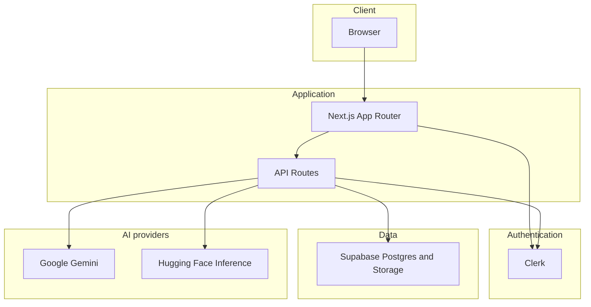

# ResumeAI

Web app for resume analysis: ATS-style scoring, insights, and career tools. Built with Next.js, Clerk for authentication, Supabase for data and file storage, and server-side AI (Google Gemini for paid users, Hugging Face for free tier where configured).

## Architecture

High-level request flow: the browser talks to Next.js (pages and API routes). Authentication is handled by Clerk. Application data and PDFs live in Supabase. AI calls run on the server only; the client never sees API keys.



## Tech stack

- Next.js (App Router), React, TypeScript
- Clerk (sign-in and session)
- Supabase (PostgreSQL, Storage, service role from server routes)
- Google Gemini and Hugging Face for text generation (routing depends on plan and route)
- Tailwind CSS, DaisyUI

## Quick start

```bash
npm install
cp .env.example .env.local
```

Fill in values from Clerk, Supabase, and AI dashboards as described in `.env.example`, then:

```bash
npm run dev
```

Open `http://localhost:3000`.

```bash
npm run build
npm run start
```

## Environment

Copy `.env.example` to `.env.local` and set at least:

- Clerk keys (`NEXT_PUBLIC_CLERK_PUBLISHABLE_KEY`, `CLERK_SECRET_KEY`)
- Supabase URL, anon key, and `SUPABASE_SERVICE_ROLE_KEY` (required for user sync and resume uploads)
- `GEMINI_API_KEY` for Pro-tier Gemini features
- `HUGGINGFACE_API_TOKEN` (and optional `HUGGINGFACE_MODEL`) for free-tier LLM routes

## Database

Run the SQL migrations in `supabase/migrations/` on your Supabase project (see comments inside each file). Without the schema and service role key, sync and storage routes will fail.

## Scripts

| Command | Description |
|---------|-------------|
| `npm run dev` | Development server |
| `npm run build` | Production build |
| `npm run start` | Run production build |
| `npm run lint` | ESLint |
| `npm run clean` | Remove `.next` cache |

## License

Private. Change this file if you publish the repository.
